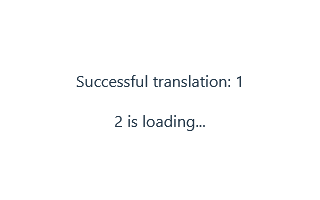
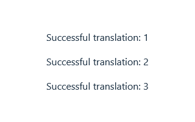

# Reproduction

- Install packages: `pnpm install`
- Run application: `pnpm dev`

There is a toggle in [src/fixedLanguage.ts](./src/fixedLanguage.ts) where you can toggle `demonstrateUnexpectedBehavior` on or off. To fully see the effect, always refresh the page after modifying the value.

- If `demonstrateUnexpectedBehavior` is `true`:  
  
- If `demonstrateUnexpectedBehavior` is `false`:  
  
